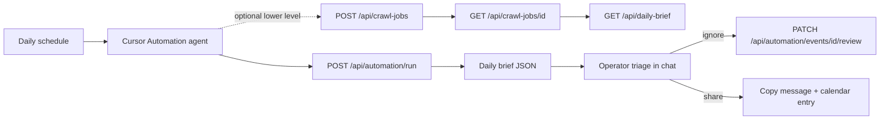

# Daily event discovery automation

Proactive daily workflow: crawl public listings, surface pending high-relevance events, and triage each as **share with candidate + calendar** or **ignore**.

This is **candidate-agnostic**. Geography, scoring keywords, brief thresholds, and outreach wording live in YAML (`campaign:` block) — not in code.

## Quick start

```bash
cp event_discovery/config.campaign.example.yaml event_discovery/config.mine.yaml
# Edit campaign:, scoring:, sources: for your geography

EVENT_DISCOVERY_CONFIG=event_discovery/config.mine.yaml \
  uv run python -m event_discovery sync-websites --config event_discovery/config.mine.yaml

# Local (same machine / volume as discovery.db):
uv run python -m event_discovery automation-run \
  --config event_discovery/config.mine.yaml \
  --account-id 1 \
  --format markdown

# Remote (deployed web app):
export EVENTS_CRAWL_API_TOKEN=your-secret
export REMOTE_BASE_URL=https://your-app.up.railway.app
./scripts/daily-automation.sh
```

## Architecture



1. **Scheduled trigger** (Cursor Automation cron, or external cron hitting the API).
2. **Crawl** all enabled sources for the account.
3. **Brief** returns pending events above `campaign.brief.min_score` with draft candidate message and calendar fields.
4. **You decide** per event: share, ignore (API marks rejected), or defer (leave pending).

## One-time setup

### 1. Deploy event-discovery

Railway (or local) with a persistent volume on `/data`. Set:

| Variable | Value |
|----------|--------|
| `EVENT_DISCOVERY_CONFIG` | Path to your overlay, e.g. `event_discovery/config.campaign.example.yaml` |
| `EVENTS_AGENT_API_TOKEN` | Long random secret for headless agents that manage sources/settings |
| `EVENTS_CRAWL_API_TOKEN` | Long random secret (32+ bytes) |
| `EVENTS_SESSION_SECRET` | Random signing secret |

Copy and customize the overlay:

```bash
cp event_discovery/config.campaign.example.yaml event_discovery/config.mine.yaml
# Edit campaign:, scoring:, sources: for your geography and ward keywords
```

Sync sources into SQLite (once, or after YAML edits):

```bash
EVENT_DISCOVERY_CONFIG=event_discovery/config.mine.yaml \
  uv run python -m event_discovery sync-websites --config event_discovery/config.mine.yaml
```

Note your **account id** (shown in the web UI after login, or from `create-account` CLI).

### 2. Store secrets for the automation

In Cursor Automation settings (or your secret store), configure:

- `EVENT_DISCOVERY_BASE_URL` — e.g. `https://your-app.up.railway.app`
- `EVENTS_CRAWL_API_TOKEN` — same as on the server
- `EVENT_DISCOVERY_ACCOUNT_ID` — numeric account id

### 3. Create the Cursor Automation

Schedule: **every weekday at 8:00** (or your preference).

The agent should:

1. `POST {BASE}/api/automation/run` with `{"wait": true, "timeout_seconds": 300}` and headers `Authorization: Bearer …`, `X-Crawl-Account-Id: …`
2. If `timed_out` is true, poll `next_poll_url` until the crawl job reaches `succeeded` or `failed`, then call `GET {BASE}/api/daily-brief`
3. If `job.status` is `failed`, show `job.error_message` and stop
4. If `brief` is null, report the current `job.status` and stop
5. If `brief.pending_count` is 0, reply briefly and stop
6. For each item in `brief.items`, present:
   - Title, when/where, score, link
   - The `candidate_message_draft`
   - The `calendar_entry` (summary, location, start)
   - Ask: **Share**, **Ignore**, or **Defer**
7. On **Ignore**: `PATCH {BASE}/api/automation/events/{id}/review` with `{"rejected": true}`
8. On **Share**: show the draft and calendar block for copy/paste; optionally `PATCH` with `{"reviewed": true}` after you send it

## Config reference (`campaign:`)

```yaml
campaign:
  display_name: "Campaign team"
  geography_label: "Burlington, Ontario"   # change for other municipalities
  timezone: "America/Toronto"
  brief:
    min_score: 1.0          # relevance threshold for the daily digest
    max_items: 15
    include_past: false
    days_ahead: 45
    only_new_since_hours: 168   # null = all pending above min_score
  outreach:
    candidate_contact_label: "Frank"   # or "the candidate"
    calendar_name: "Campaign events"
    briefing_notes: |
      Optional paragraph appended to every draft message.
```

Scoring keywords (`scoring.positive_keywords`, `ward_keywords`, `negative_keywords`) and crawl sources (`sources:`) use the same overlay file — see [config.campaign.example.yaml](../event_discovery/config.campaign.example.yaml).

## CLI reference

| Command | Purpose |
|---------|---------|
| `automation-run` | Full crawl + daily brief (local DB or `--remote BASE_URL`) |
| `daily-brief` | Brief only from existing DB (no crawl) |
| `sync-websites` | Push YAML `sources:` into SQLite |

```bash
# Brief only (JSON)
uv run python -m event_discovery daily-brief --account-id 1 --format json

# Skip crawl, refresh brief from DB
uv run python -m event_discovery automation-run --skip-crawl --format markdown

# Remote against deployed API
EVENTS_CRAWL_API_TOKEN=… uv run python -m event_discovery automation-run \
  --remote https://your-app.example --account-id 1 --format markdown
```

## HTTP API

## Agent API

Agents can use either browser-style session auth or headless Bearer auth.

### Auth modes

Session mode is useful when the agent can keep cookies:

```bash
curl -i -sS -X POST "$BASE_URL/api/auth/signup" \
  -H "Content-Type: application/json" \
  -d '{"email":"agent@example.com","password":"longenough"}'

curl -i -sS -X POST "$BASE_URL/api/auth/login" \
  -H "Content-Type: application/json" \
  -d '{"email":"agent@example.com","password":"longenough"}'
```

The response includes `account_id`; preserve the returned session cookie for follow-up calls.

Headless mode is useful for automation platforms that do not keep cookies. Configure `EVENTS_AGENT_API_TOKEN` on the server, then send:

```bash
export AGENT_TOKEN=your-agent-token
export ACCOUNT_ID=1

curl -sS "$BASE_URL/api/websites" \
  -H "Authorization: Bearer $AGENT_TOKEN" \
  -H "X-Agent-Account-Id: $ACCOUNT_ID"
```

`EVENTS_AGENT_API_TOKEN` is broader than `EVENTS_CRAWL_API_TOKEN`: it can manage account-scoped sources and discovery settings. Keep the crawl token for narrow scheduled crawl/triage jobs.

### Source Discovery

Ask the app to inspect a URL and propose the best source configuration:

```bash
curl -sS -X POST "$BASE_URL/api/source-discovery" \
  -H "Authorization: Bearer $AGENT_TOKEN" \
  -H "X-Agent-Account-Id: $ACCOUNT_ID" \
  -H "Content-Type: application/json" \
  -d '{"url":"https://example.org/events","source_label":"Example events","use_llm":true}' | jq .
```

For a one-step add, use quick-add. It creates a disabled source so the agent or operator can inspect it before enabling:

```bash
curl -sS -X POST "$BASE_URL/api/websites/quick-add" \
  -H "Authorization: Bearer $AGENT_TOKEN" \
  -H "X-Agent-Account-Id: $ACCOUNT_ID" \
  -H "Content-Type: application/json" \
  -d '{"url":"https://example.org/events","name":"Example events","use_llm":true}' | jq .
```

### Source Management

List sources:

```bash
curl -sS "$BASE_URL/api/websites" \
  -H "Authorization: Bearer $AGENT_TOKEN" \
  -H "X-Agent-Account-Id: $ACCOUNT_ID" | jq .
```

Create a source directly:

```bash
curl -sS -X POST "$BASE_URL/api/websites" \
  -H "Authorization: Bearer $AGENT_TOKEN" \
  -H "X-Agent-Account-Id: $ACCOUNT_ID" \
  -H "Content-Type: application/json" \
  -d '{
    "source_key":"city_events",
    "source_label":"City events",
    "type":"json_ld_events",
    "enabled":false,
    "config":{"page_url":"https://example.org/events"}
  }' | jq .
```

Modify, enable, disable, reorder, or delete sources:

```bash
curl -sS -X PATCH "$BASE_URL/api/websites/123" \
  -H "Authorization: Bearer $AGENT_TOKEN" \
  -H "X-Agent-Account-Id: $ACCOUNT_ID" \
  -H "Content-Type: application/json" \
  -d '{"enabled":true,"source_label":"Updated city events"}' | jq .

curl -sS -X POST "$BASE_URL/api/websites/123/recheck" \
  -H "Authorization: Bearer $AGENT_TOKEN" \
  -H "X-Agent-Account-Id: $ACCOUNT_ID" | jq .

curl -sS -X DELETE "$BASE_URL/api/websites/123?delete_events=false" \
  -H "Authorization: Bearer $AGENT_TOKEN" \
  -H "X-Agent-Account-Id: $ACCOUNT_ID" | jq .
```

Useful supporting endpoints:

- `GET /api/website-source-types`: valid source types and config fields.
- `POST /api/websites/{id}/test`: dry-run one source and return a sample without saving events.
- `PATCH /api/websites/bulk-enabled`: enable or disable all sources.
- `PUT /api/websites/reorder`: set source display order with `{"ids":[...]}`.

### Delivery Settings

Agents can configure where automation results should be sent. Webhook URLs must be HTTPS in production.

```bash
curl -sS "$BASE_URL/api/automation/delivery" \
  -H "Authorization: Bearer $AGENT_TOKEN" \
  -H "X-Agent-Account-Id: $ACCOUNT_ID" | jq .

curl -sS -X PUT "$BASE_URL/api/automation/delivery" \
  -H "Authorization: Bearer $AGENT_TOKEN" \
  -H "X-Agent-Account-Id: $ACCOUNT_ID" \
  -H "Content-Type: application/json" \
  -d '{
    "webhooks":[
      {"id":"brief","label":"Daily brief","url":"https://hooks.example.org/brief","enabled":true}
    ],
    "skip_if_empty":true
  }' | jq .
```

### Discovery Settings

Agents can read and patch account-level crawl/scoring settings:

```bash
curl -sS "$BASE_URL/api/discovery-settings" \
  -H "Authorization: Bearer $AGENT_TOKEN" \
  -H "X-Agent-Account-Id: $ACCOUNT_ID" | jq .

curl -sS -X PATCH "$BASE_URL/api/discovery-settings" \
  -H "Authorization: Bearer $AGENT_TOKEN" \
  -H "X-Agent-Account-Id: $ACCOUNT_ID" \
  -H "Content-Type: application/json" \
  -d '{"scoring":{"horizon_days":45},"enrichment":{"enabled":true,"max_urls":100}}' | jq .
```

### Recommended Agent Loop

1. Sign up or log in with `/api/auth/*`, or use `EVENTS_AGENT_API_TOKEN` + `X-Agent-Account-Id`.
2. Discover or add sources with `/api/source-discovery`, `/api/websites/quick-add`, or `POST /api/websites`.
3. Test new sources with `POST /api/websites/{id}/test`.
4. Enable sources with `PATCH /api/websites/{id}`.
5. Optionally configure delivery with `PUT /api/automation/delivery`.
6. Run discovery with `POST /api/automation/run`.
7. Triage `brief.items[]`; mark ignored/shared items via `PATCH /api/automation/events/{id}/review`.

### One-call agent run

Use this for Cursor Automations and other agents that want one request to start a crawl and receive the triage payload when it finishes.

```bash
export BASE_URL=https://your-app.example
export AGENT_TOKEN=your-agent-token
export ACCOUNT_ID=1

curl -sS -X POST "$BASE_URL/api/automation/run" \
  -H "Authorization: Bearer $AGENT_TOKEN" \
  -H "X-Agent-Account-Id: $ACCOUNT_ID" \
  -H "Content-Type: application/json" \
  -d '{"kind":"full","wait":true,"timeout_seconds":300,"poll_seconds":5}' | jq .
```

Response shape:

```json
{
  "job": {
    "id": 123,
    "kind": "full",
    "status": "succeeded",
    "event_count": 42,
    "error_message": null
  },
  "brief": {
    "pending_count": 2,
    "items": []
  },
  "timed_out": false,
  "next_poll_url": null,
  "brief_url": "/api/daily-brief"
}
```

Agent branching rules:

- `job.status == "failed"`: report `job.error_message`; do not triage.
- `timed_out == true` or `next_poll_url != null`: poll `next_poll_url`, then fetch `brief_url` once the job succeeds.
- `brief == null`: report the current `job.status`; there is no triage payload yet.
- `brief.pending_count == 0`: report no pending events.
- For each `brief.items[]`, ask the operator to **Share**, **Ignore**, or **Defer**.

### Lower-level crawl and brief

Use this when your agent runtime cannot hold a request open or needs custom polling.

```bash
export BASE_URL=https://your-app.example
export TOKEN=your-crawl-token
export ACCOUNT_ID=1

curl -sS -X POST "$BASE_URL/api/crawl-jobs" \
  -H "Authorization: Bearer $TOKEN" \
  -H "X-Crawl-Account-Id: $ACCOUNT_ID" \
  -H "Content-Type: application/json" \
  -d '{"kind":"full"}'

curl -sS "$BASE_URL/api/daily-brief" \
  -H "Authorization: Bearer $TOKEN" \
  -H "X-Crawl-Account-Id: $ACCOUNT_ID" | jq .
```

### Brief webhook destinations

Per-account webhook URLs for scheduled brief delivery (`cron-run` loads these via `GET /api/automation/delivery`):

```bash
curl -sS "$BASE_URL/api/automation/delivery" \
  -H "Authorization: Bearer $TOKEN" \
  -H "X-Crawl-Account-Id: $ACCOUNT_ID" | jq .

curl -sS -X PUT "$BASE_URL/api/automation/delivery" \
  -H "Authorization: Bearer $TOKEN" \
  -H "X-Crawl-Account-Id: $ACCOUNT_ID" \
  -H "Content-Type: application/json" \
  -d '{
    "webhooks": [
      {"label": "Slack", "url": "https://hooks.slack.com/services/...", "enabled": true}
    ],
    "skip_if_empty": false
  }' | jq .
```

In the web UI: **Sites → Daily brief webhooks**.

## Alternative: Railway cron + webhook

For unattended daily digests (no interactive triage), deploy a **separate stateless Railway cron service** that runs `python -m event_discovery cron-run`. It triggers a full crawl on the web app, fetches `/api/daily-brief`, and POSTs to webhook destinations configured per account (`PUT /api/automation/delivery` or **Sites → Daily brief webhooks** in the UI).

See [CRON.md](CRON.md) for setup, env vars, and Slack/generic webhook payload shapes.

For interactive Share / Ignore / Defer, use the Cursor Automation flow above instead.
