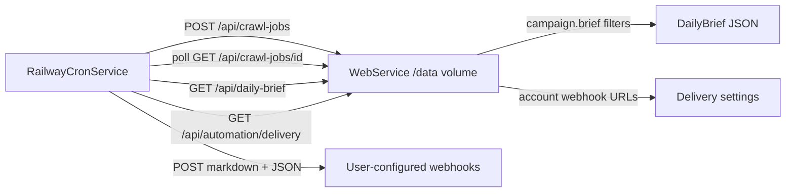

# Railway cron service

Stateless scheduled service that triggers a full crawl on the **web app**, fetches the campaign-filtered daily brief, and POSTs it to webhook destinations configured by each account in the web UI (**Sites → Daily brief webhooks**).

The cron service does **not** mount the discovery volume. Brief filtering uses `campaign.brief` on the web service; webhook URLs are stored per account in SQLite.

## Architecture



## Prerequisites (web service)

1. Web service deployed with volume at `/data` ([railway.toml](../railway.toml) `requiredMountPath`).
2. `EVENTS_CRAWL_API_TOKEN` set on the web service (long random secret).
3. `EVENT_DISCOVERY_CONFIG` pointing at your campaign overlay with `campaign.brief` thresholds.
4. Sources synced: `uv run python -m event_discovery sync-websites --config …`
5. Note your numeric **account id** (web UI or `create-account` CLI).
6. Each account configures webhook destinations under **Sites → Daily brief webhooks** in the web UI (or `PUT /api/automation/delivery`).

## Create the cron service

### Option A: Railway API script (recommended)

From the repo root, with the Railway CLI logged in:

```bash
# Creates/updates the cron service, env vars, schedule, and triggers deploy
uv run python scripts/railway_setup_cron.py

# Deploy local code (required until cron-run is on the default Git branch):
railway service cron && railway up -s cron -d
```

The script uses the [Railway GraphQL API](https://docs.railway.com/integrations/api/api-cookbook) to create the `cron` service, set `startCommand` / `cronSchedule`, and upsert environment variables.

### Option B: Manual dashboard setup

1. In the same Railway project, add a **new service** from this repo (e.g. `event-discovery-cron`).
2. **Do not attach a volume** to this service.
3. Set **Start Command** to:

   ```bash
   python -m event_discovery cron-run
   ```

   See [railway.cron.toml](../railway.cron.toml) for build settings reference.

4. Set **Cron Schedule** in the Railway **dashboard** (Settings → Cron Schedule). Config-as-code cron schedules have had reliability issues; use the dashboard for production.

   Example: weekday 8:00 **America/Toronto** (adjust for DST):

   | Local time | UTC offset | Crontab |
   |------------|------------|---------|
   | 8:00 EST   | UTC-5      | `0 13 * * 1-5` |
   | 8:00 EDT   | UTC-4      | `0 12 * * 1-5` |

   Railway evaluates cron in **UTC**. Minimum interval: 5 minutes.

5. Set environment variables on the **cron service**:

   | Variable | Required | Description |
   |----------|----------|-------------|
   | `EVENT_DISCOVERY_BASE_URL` | yes | Public web app URL, e.g. `https://your-app.up.railway.app` |
   | `EVENTS_CRAWL_API_TOKEN` | yes | Same secret as on the web service |
   | `DISCOVERY_ACCOUNT_ID` | yes | Numeric account id |
   | `CRON_POLL_SECONDS` | no | Poll interval (default `5`) |
   | `CRON_TIMEOUT_SECONDS` | no | Max crawl wait in seconds (default `900`) |
   | `BRIEF_FORMAT` | no | `markdown` (default) — includes `markdown` field in payload |
   | `BRIEF_WEBHOOK_URL` | no | Legacy env fallback if no account webhooks are configured |
   | `CRON_SKIP_WEBHOOK_IF_EMPTY` | no | Env override: `1` to skip when `pending_count == 0` (account UI setting also available) |

   Webhook URLs are **not** set on the cron service. Configure them per account in the web UI or via:

   ```bash
   curl -sS -X PUT "$BASE_URL/api/automation/delivery" \
     -H "Authorization: Bearer $TOKEN" \
     -H "X-Crawl-Account-Id: $ACCOUNT_ID" \
     -H "Content-Type: application/json" \
     -d '{"webhooks":[{"label":"Slack","url":"https://hooks.slack.com/services/...","enabled":true}],"skip_if_empty":false}'
   ```

## Manual test

Before enabling the schedule:

```bash
export EVENT_DISCOVERY_BASE_URL=https://your-app.up.railway.app
export EVENTS_CRAWL_API_TOKEN=your-secret
export DISCOVERY_ACCOUNT_ID=1

uv run python -m event_discovery cron-run
```

Configure at least one webhook in the web UI first. Confirm the webhook receives the brief. Exit code `0` means success; `1` crawl/delivery failure; `2` missing env.

## Webhook payload

**Generic URL** — JSON body:

```json
{
  "status": "ok",
  "pending_count": 2,
  "generated_at_utc": "...",
  "geography_label": "Burlington, Ontario",
  "display_name": "Campaign team",
  "markdown": "# Event discovery brief — …",
  "brief": { "items": [], "filters": {}, ... }
}
```

**Slack** (`hooks.slack.com`) — body is `{"text": "<markdown>"}`.

**On failure** — cron POSTs `{"status": "failed", "error": "...", "generated_at_utc": "..."}` when possible, then exits non-zero.

## Operations

- The cron process **must exit** when done. If it stays running, Railway skips the next scheduled run.
- Monitor logs after the first scheduled execution; a stuck "Running" deployment usually means the process did not exit.
- For interactive triage (Share / Ignore / Defer), use [AUTOMATION.md](AUTOMATION.md) (Cursor Automation). The cron service delivers the digest only.

## Related docs

- [AUTOMATION.md](AUTOMATION.md) — daily brief API, Cursor Automation, `campaign:` config
- [PRODUCTION.md](PRODUCTION.md) — production checklist
- [README.md](../README.md) — scheduled crawls overview
